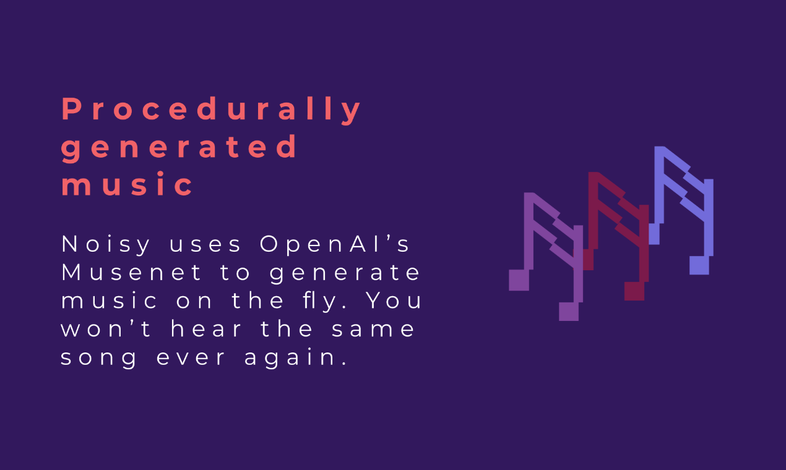
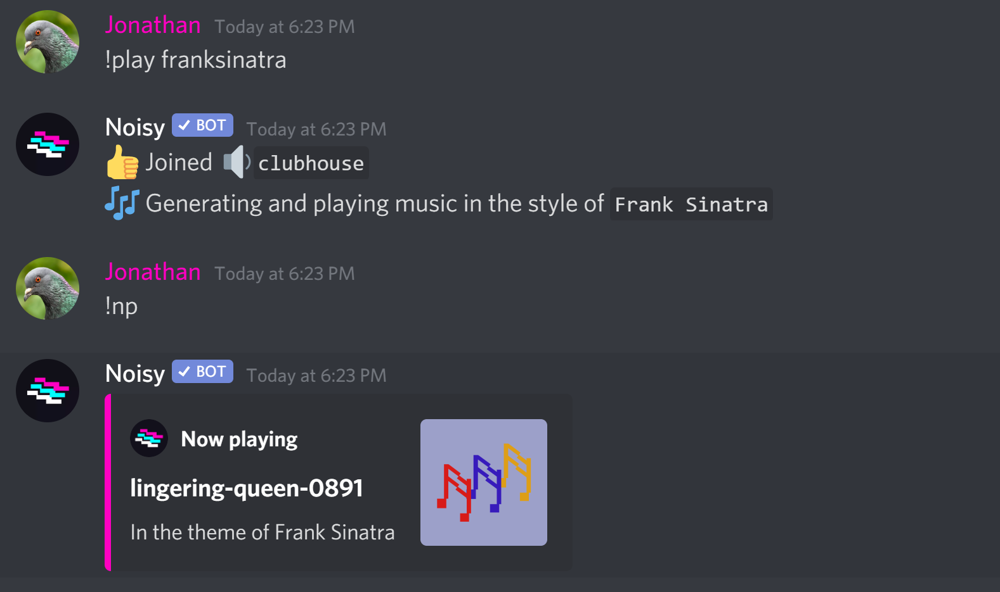

# Noisy

[Noisy](https://noisy.vercel.app/) uses OpenAI’s [Musenet](https://openai.com/blog/musenet/) to generate music on the fly. Listen with friends to a diverse set of 17+ genres, ranging from Mozart to Lady Gaga. The goal is to create quality music for social situations, without needing to worry about playlists, URLs, or copyright infringements. Every song is unique and will only be played once.

Check it out at https://noisy.vercel.app




This code powers noisy.live's Discord and Telegram bots. Let us know if you'd like to view the code for the website, backend or Musenet Generator.

### Usage example



## Feature Requests and Bug Reports

If you have any suggestions, we'd love to [hear your feedback](https://github.com/JonathanXu1/noisy-bot/issues/new/choose) and improve the bot to maximise happiness! Note: we're using Github issues, so you may need to create a Github account first before being able to fill feature requests and bug reports.

## How It Works

We generate new songs of a given genre by querying Musenet with the appropriate parameters. For each genre we store a list of available songs, and when the song currently being played is near the end of that list we query Musenet for new songs to add to the list. New songs are generated with beginnings identical to the endings of the most recent song in the given genre, so that we create relatively continuous sequences of songs which eventually diverge far from their starting points.

## Contributors

We built Noisy! Hope you like it :D

If you have any questions or concerns about the bot (security, privacy, data, features) that need to be addressed privately, you can directly message any one of us at the contacts listed on our profiles.

[Jonathan Xu](https://github.com/JonathanXu1)
[Ricky Mao](https://github.com/rickrm)
[Vincent Huang](https://github.com/vincenthuang75025)

## Special thanks

- Aaron Abraham
- Dmitri Brereton
- Chris Axon
- kvacm (for the background: https://www.deviantart.com/kvacm/art/Moons-743143427)

## Local development

Currently, our modules expect you to have a NodeJS version of at least 12. Install it [here](https://nodejs.org/en/download/)

First, you need to get the `.env` file from one of the project contributors. The env file contains the bot token for Noisy-test. Place the file in the root folder. After, you can run the bot locally and it will be live on localhost:3002. The environment variables for production is different, and is on Heroku as config vars, and it is used by builds to the Github master branch.

Depending on what bot you are developing for, check the corresopnding README.

Readme for the Discord bot: https://github.com/JonathanXu1/noisy-bot/tree/master/discord
Readme for the Telegram bot: https://github.com/JonathanXu1/noisy-bot/tree/master/telegram

If you want to test running both bots at the same time (like on production), run the following in this folder:

```
nodemon index.js
```
